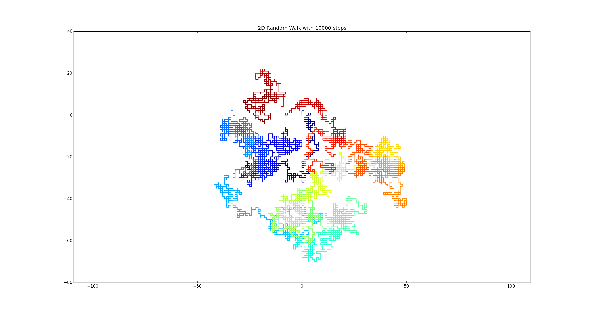
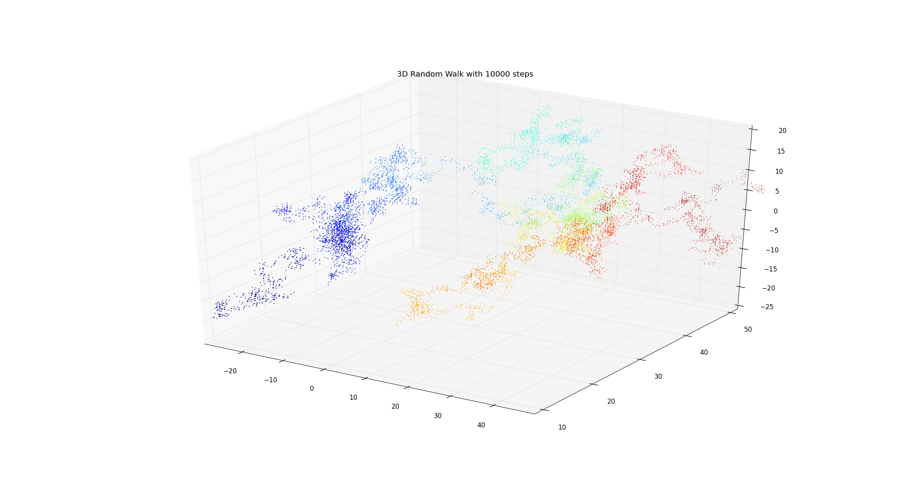

# Random walks

This is a series of random walks under different conditions, ranging from a simple 2D walk with up-down-left-right movements

and a 3D walk with 27 different possible movements.

To understand how many moves there are in a given dimension, think of a square and how many there to get from the middle to the edges and how precise you want to be. For example, on a flat square you can go four ways (to every corner) and four more with the edges. On a cube there are eight corners, twelve edges and six faces, so twenty six possible ways. There are four Python scripts, two for 2D and two for 3D (both with and without fancy movements).